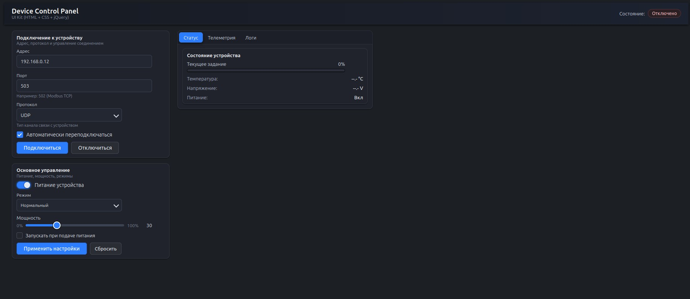

# HTML UI Components (Qt-Style)

Набор самостоятельных UI-компонентов для Web, разработанных в стиле Qt Widgets.  
Каждый элемент хранится в отдельной папке и содержит собственные файлы **HTML / CSS / JS**, а также jQuery-расширения.  
Проект создан с целью обеспечить быстрый перенос готовых UI-блоков.


## 📁 Структура проекта
```sh
project/
│
├── Base/                          # Базовые UI-элементы (Qt-style)
│   ├── Buttons/
│   │   ├── src/                   # Исходники компонента
│   │   └── example/               # Пример подключения
│   │
│   ├── Checkbox/
│   │   ├── src/
│   │   └── example/
│   │
│   ├── ComboBox/
│   │   ├── src/
│   │   └── example/
│   │
│   ├── GroupBox/
│   │   ├── src/
│   │   └── example/
│   │
│   ├── Lineedit/
│   │   ├── src/
│   │   └── example/
│   │
│   ├── ProgressBar/
│   │   ├── src/
│   │   └── example/
│   │
│   ├── RadioButton/
│   │   ├── src/
│   │   └── example/
│   │
│   ├── Slider/
│   │   ├── src/
│   │   └── example/
│   │
│   ├── TabWidget/
│   │   ├── src/
│   │   └── example/
│   │
│   └── Toggle/
│       ├── src/
│       └── example/
│
└── demo/                          # Демо-страница со всеми компонентами

```


